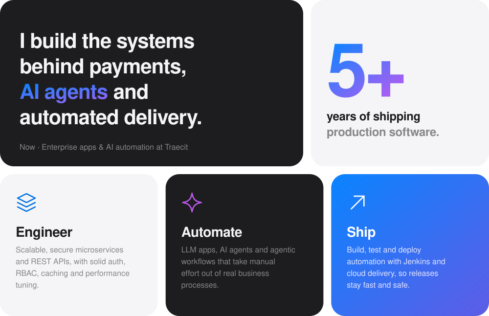
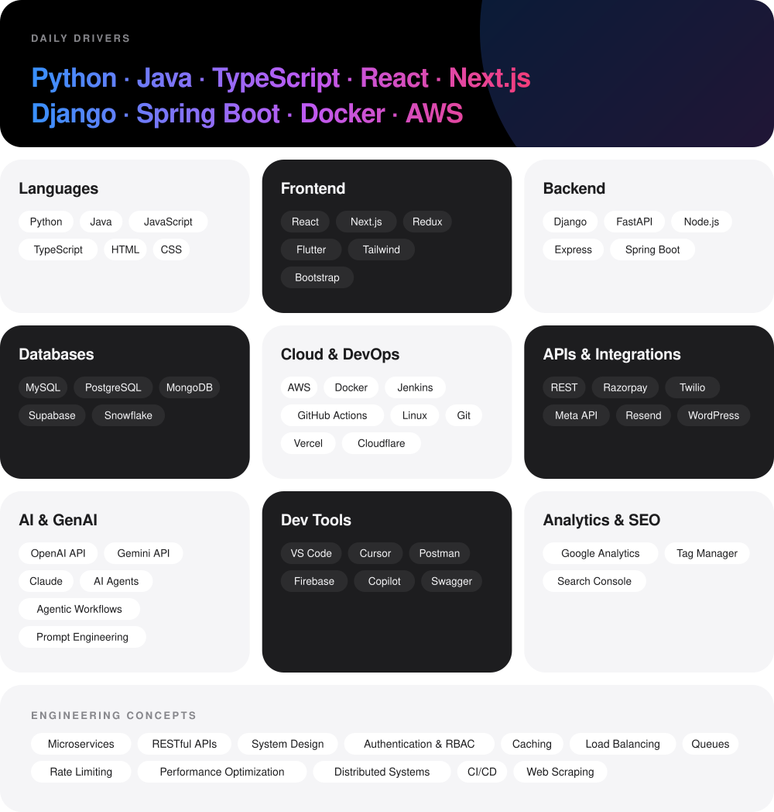
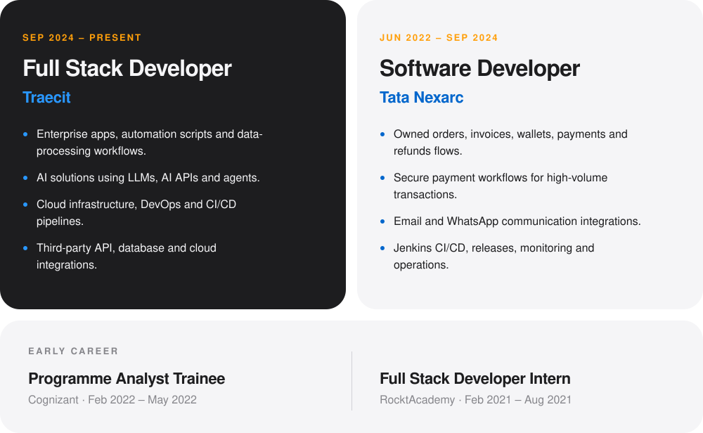
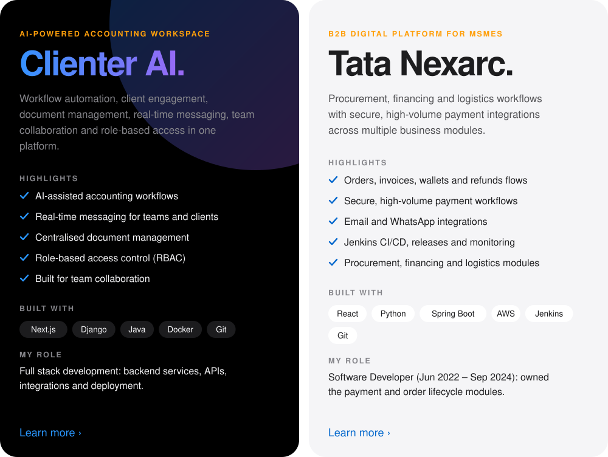
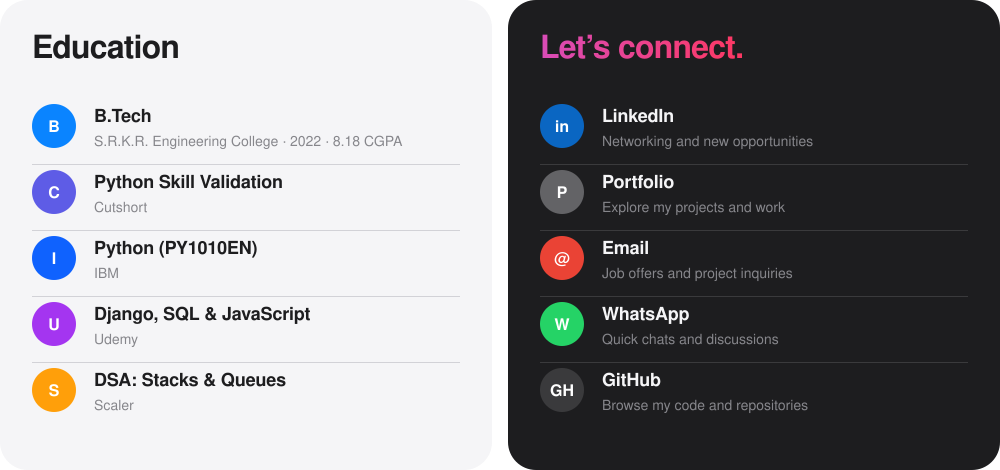

<a href="#about">About</a> &nbsp;·&nbsp; <a href="#stack">Tech stack</a> &nbsp;·&nbsp; <a href="#exp">Experience</a> &nbsp;·&nbsp; <a href="#projects">Projects</a> &nbsp;·&nbsp; <a href="#github">GitHub</a> &nbsp;·&nbsp; <a href="#connect">Contact</a>

<picture>
  <source media="(prefers-color-scheme: dark)" srcset="assets/h-about-dark.svg">
  
</picture>

<picture>
  <source media="(prefers-color-scheme: dark)" srcset="assets/h-stack-dark.svg">
  
</picture>

<picture>
  <source media="(prefers-color-scheme: dark)" srcset="assets/h-exp-dark.svg">
  
</picture>

<picture>
  <source media="(prefers-color-scheme: dark)" srcset="assets/h-projects-dark.svg">
  
</picture>

[See more work &rsaquo;](https://prudhvi-kollana-portfolio.vercel.app/)

<picture>
  <source media="(prefers-color-scheme: dark)" srcset="assets/h-github-dark.svg">
  
</picture>

<picture>
  <source media="(prefers-color-scheme: dark)" srcset="https://raw.githubusercontent.com/prudhvikollanapK/prudhvikollanapK/output/github-contribution-grid-snake-dark.svg" />
  <source media="(prefers-color-scheme: light)" srcset="https://raw.githubusercontent.com/prudhvikollanapK/prudhvikollanapK/output/github-contribution-grid-snake.svg" />
  
</picture>

[Browse repositories &rsaquo;](https://github.com/prudhvikollanapK)

<picture>
  <source media="(prefers-color-scheme: dark)" srcset="assets/h-connect-dark.svg">
  
</picture>

<a href="https://www.linkedin.com/in/prudhvikollanapk/">LinkedIn &rsaquo;</a> &nbsp;&nbsp; <a href="https://prudhvi-kollana-portfolio.vercel.app/">Portfolio &rsaquo;</a> &nbsp;&nbsp; <a href="mailto:kprudhvi555777@gmail.com">Email &rsaquo;</a> &nbsp;&nbsp; <a href="https://wa.me/917569875288?text=Hello%20Prudhvi">WhatsApp &rsaquo;</a> &nbsp;&nbsp; <a href="https://github.com/prudhvikollanapK">GitHub &rsaquo;</a>

