<!-- ═══════════════════════ HERO ═══════════════════════ -->

<!-- ═══════════════════════ ABOUT ═══════════════════════ -->
## ⚡ About Me

> [!NOTE]
> I'm a **Full Stack Engineer with 5+ years of experience** turning complex business problems into clean, reliable, production-ready systems. I work across the stack, from **payment-grade backends** and **CI/CD pipelines** to **LLM-powered products and AI agents**.

<table width="100%">
<tr>
<td width="33%" valign="top" align="left">

#### 🏗️ Engineer
Scalable, secure **microservices & REST APIs** with solid auth, RBAC, caching and performance tuning.

</td>
<td width="33%" valign="top" align="left">

#### 🤖 Automate
**LLM apps, AI agents** and agentic workflows that remove manual effort from real business processes.

</td>
<td width="33%" valign="top" align="left">

#### 🚀 Ship
**Build → test → deploy** automation with Jenkins and cloud delivery, so releases stay fast and safe.

</td>
</tr>
</table>

<!-- ═══════════════════════ SKILLS ═══════════════════════ -->
## 🧠 Tech Arsenal

### 🔥 Daily Drivers

  

| | Category | Stack |
|:-:|:--|:--|
| 💬 | **Languages** |  |
| 🎨 | **Frontend** |  |
| ⚙️ | **Backend** |  |
| 🗄️ | **Databases** |   |
| ☁️ | **Cloud & DevOps** |  |
| 🔌 | **APIs & Integrations** |       |
| 🤖 | **AI & GenAI** |       |
| 🛠️ | **Dev Tools** |    |
| 📊 | **Analytics & SEO** |    |

<b>🏗️ Engineering concepts I work with</b>

 

`Microservices` · `RESTful APIs` · `System Design` · `Authentication & RBAC` · `Caching` · `Load Balancing` · `Queues` · `Rate Limiting` · `Performance Optimization` · `Distributed Systems` · `CI/CD` · `Web Scraping`

## 📈 At a Glance

| 🏆 5+ Years | 🏢 Enterprise Scale | 🤖 AI & Agents | ⚙️ DevOps |
|:---:|:---:|:---:|:---:|
| Professional experience | High-volume payment platforms | LLM apps & automation | Jenkins CI/CD pipelines |

<!-- ═══════════════════════ EXPERIENCE ═══════════════════════ -->
---

## 💼 Experience

<table width="100%">
<tr>
<td width="50%" valign="top">

### 🔷 Full Stack Developer — Traecit
`Sep 2024 – Present`

- 🧩 Enterprise apps, automation scripts & data-processing workflows
- 🤖 AI solutions using **LLMs, AI APIs & agents**
- ☁️ Cloud infrastructure, DevOps & **CI/CD** pipelines
- 🔗 Third-party API, database & cloud integrations

</td>
<td width="50%" valign="top">

### 🔶 Software Developer — Tata Nexarc
`Jun 2022 – Sep 2024`

- 🛒 Owned orders, invoices, wallets, payments & refunds flows
- 💳 Secure payment workflows & high-volume transactions
- 📲 Email + WhatsApp communication integrations
- 🔄 Jenkins CI/CD, releases, monitoring & operations

</td>
</tr>
</table>

<b>🎓 Early Career & Internships</b>

 

- **Programme Analyst Trainee — Cognizant** (Feb 2022 – May 2022)
- **Full Stack Developer Intern — RocktAcademy** (Feb 2021 – Aug 2021)

---

<!-- ═══════════════════════ PROJECTS ═══════════════════════ -->
## 🚀 Featured Projects

<table width="100%">
<tr>
<td width="50%" valign="top">

### 🧾 Clienter AI
**AI-powered accounting workspace**

Workflow automation, client engagement, document management, real-time messaging, team collaboration and role-based access in one platform.

**✨ Highlights**
- 🤖 AI-assisted accounting workflows
- 💬 Real-time messaging between teams & clients
- 📁 Centralised document management
- 🔐 Role-based access control (RBAC)
- 👥 Built for team collaboration

**🛠️ Built with**
`Next.js` · `Django` · `Java` · `Docker` · `Git`

**👤 My role**
Full stack development: backend services, APIs, integrations and deployment.

</td>
<td width="50%" valign="top">

### 🏭 Tata Nexarc
**B2B digital platform for MSMEs**

Procurement, financing and logistics workflows with secure, high-volume payment integrations across multiple business modules.

**✨ Highlights**
- 🛒 Orders, invoices, wallets & refunds flows
- 💳 Secure, high-volume payment workflows
- 📲 Email + WhatsApp communication integrations
- 🔄 Jenkins CI/CD, releases & monitoring
- 🏢 Procurement, financing & logistics modules

**🛠️ Built with**
`React` · `Python` · `Spring Boot` · `AWS` · `Jenkins` · `Git`

**👤 My role**
Software Developer (Jun 2022 – Sep 2024): owned the payment and order lifecycle modules end to end.

</td>
</tr>
</table>

🔗 **More work:** [prudhvi-kollana-portfolio.vercel.app](https://prudhvi-kollana-portfolio.vercel.app/)

<!-- ═══════════════════════ STATS ═══════════════════════ -->
## 📊 GitHub Analytics

 

<!-- ═══════════════════════ SNAKE ═══════════════════════ -->

<picture>
  <source media="(prefers-color-scheme: dark)" srcset="https://raw.githubusercontent.com/prudhvikollanapK/prudhvikollanapK/output/github-contribution-grid-snake-dark.svg" />
  <source media="(prefers-color-scheme: light)" srcset="https://raw.githubusercontent.com/prudhvikollanapK/prudhvikollanapK/output/github-contribution-grid-snake.svg" />
  
</picture>

<!-- ═══════════════════════ EDUCATION + CONNECT (ONE TABLE = EQUAL SIZE) ═══════════════════════ -->
## 🎓 Education & 🌐 Connect

<table width="100%">
<tr>
<th colspan="2" align="left" width="50%">🎓 Education & Certifications</th>
<th colspan="2" align="left" width="50%">🌐 Let's Connect & Build Something Great</th>
</tr>

<tr>
<td align="center" width="8%">

</td>
<td width="42%"><strong>B.Tech</strong> · S.R.K.R. Engineering College · 2022 · 8.18 CGPA</td>
<td align="center" width="8%">

</td>
<td width="42%">Networking and new opportunities</td>
</tr>

<tr>
<td align="center">

</td>
<td>Python Skill Validation · <strong>Cutshort</strong></td>
<td align="center">

</td>
<td>Explore my projects and work</td>
</tr>

<tr>
<td align="center">

</td>
<td>Python (PY1010EN) · <strong>IBM</strong></td>
<td align="center">

</td>
<td>Job offers and project inquiries</td>
</tr>

<tr>
<td align="center">

</td>
<td>Django, SQL & JavaScript · <strong>Udemy</strong></td>
<td align="center">

</td>
<td>Quick chats and discussions</td>
</tr>

<tr>
<td align="center">

</td>
<td>DSA: Stacks & Queues · <strong>Scaler</strong></td>
<td align="center">

</td>
<td>Browse my code and repositories</td>
</tr>
</table>

---

### ✨ *Start where you are. Use what you have. Do what you can.*

